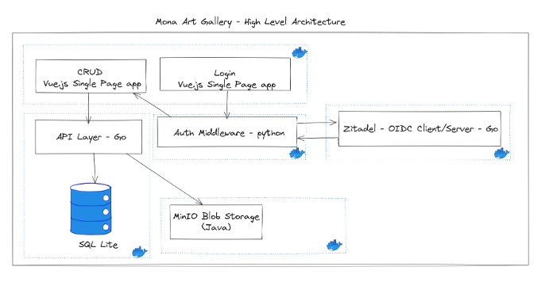

<h1 align="center">Mona Gallery</h1>

  <a href="#introduction">Introduction</a> •
  <a href="#prerequisites">Prerequisites</a> •
  <a href="#mona-gallery">Mona Gallery</a> •  
  <a href="#license">License</a> •
  <a href="#maintainers">Maintainers</a> •
  <a href="#support">Support</a> •
  <a href="#learning-resources">Learning Resources</a> •

### Introduction

This repository contains the source code for the delibrately vulnerable `Mona Gallery` web application used for security training purposes.

### Prerequisites

If you want to run the `Mona Gallery` application, you will require Docker. You can run the application with a simple `docker compose up` command. For more information on ports and services see the [docker compose file](./docker-compose.yaml).

There are two users you can use to log into the app via OIDC integration. For details see [passwords file](./passwords.txt).

### Mona Gallery

The Mona Gallery is a delibrately vulnerable web application consisting of several prevalent vulnerability types, such as SQL injection, XSS, and deserialization, among others. The application's codebase is diverse, utilizing multiple technologies, including Go, Python, Javascript, and Java. A architecture diagram can be found below.  We will use this application's codebase for this workshop.

#### Architecture Diagram 

The application's frontend is built with Vue.js 3 and Bootstrap 5, while authorization is managed through the Zitadel OIDC service implemented in Go. Middleware functions are handled in Python. The API is developed in Go, and Blob storage is implemented with MinIO, written in Java. Furthermore, the API layer is also implemented in Go, and the database relies on SQL Lite. Each of these services is encapsulated in its respective Docker container, resulting in a total of five images. To run the application, you can utilize Docker Compose.  

## License 

This project is licensed under the terms of the MIT open source license. Please refer to [MIT](./LICENSE.txt) for the full terms.

## Maintainers 

See the [CODEOWNERS](./.github/CODEOWNERS) for the list of maintainers.

## Support

The support process is outlined in the [SUPPORT.md](./SUPPORT.md)

### Learning Resources

  - [GitHub Advanced Security Learning Path - Microsoft Learn](https://learn.microsoft.com/en-us/collections/rqymc6yw8q5rey)
  - [Docs - GitHub Advanced Security](https://docs.github.com/en/enterprise-cloud@latest/get-started/learning-about-github/about-github-advanced-security)
  - [GitHub Copilot Learning Path - Microsoft Learn](https://learn.microsoft.com/en-us/training/modules/introduction-to-github-copilot/)
  - [Docs - GitHub Copilot](https://docs.github.com/en/copilot)
